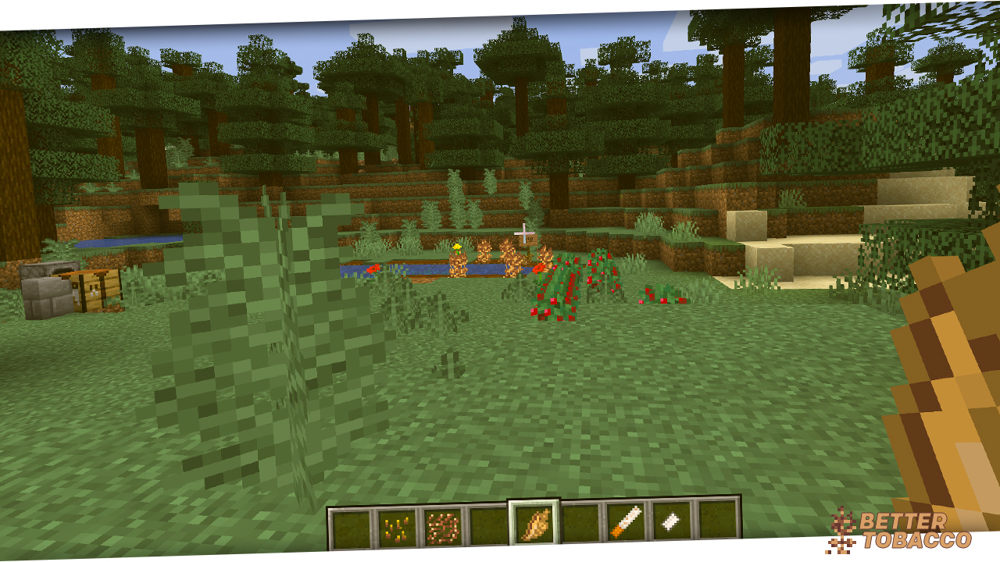
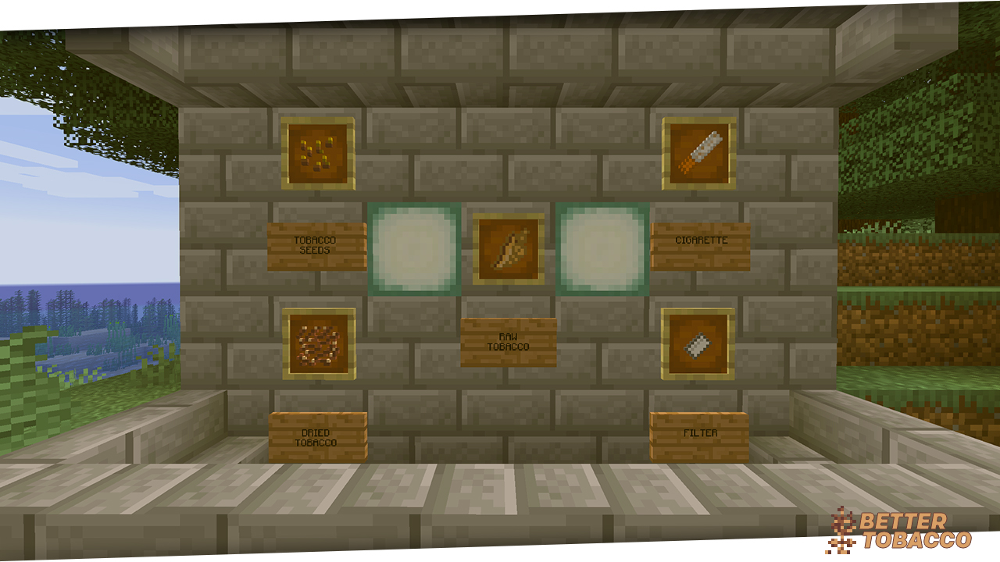

     
    
    <h1>BetterTobacco</h1>
    <h3>Better Tobacco Mod for Minecraft 1.14.4</h3>

## Screenshots

Items            |  Crops
:-------------------------:|:-------------------------:
  |  
Items                | ...
 | .

## Supported Languages
- [x] AT 🇦🇹
- [x] CH 🇨🇭
- [x] DE 🇩🇪
- [x] US 🇺🇸🇬🇧🇨🇦🇦🇺
- [x] RS 🇷🇸
- [x] HR 🇭🇷
- [x] BA 🇧🇦
- [x] HU 🇭🇺
- [x] TR 🇹🇷

## TODO

### Add Items (Model, Textures, Lang, Functionality)
- [x] Add Tobacco Seeds
- [x] Add Dried Tobacco
- [x] Add Cigarettes
- [ ] Add *Suprise* Item
- [ ] Add Hookah Tobacco

### Add Blocks (Model, Textures, Lang, Functionality)
- [ ] Add Hookah

### Add Concepts for:
- [ ] Hookah
- [ ] Biomes
- [ ] Custom Armor
- [ ] Custom Tools & Weapons
- [ ] Custom Mobs

### Like our work?

*Every donation is welcome!*

