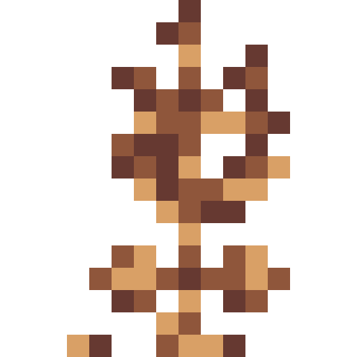
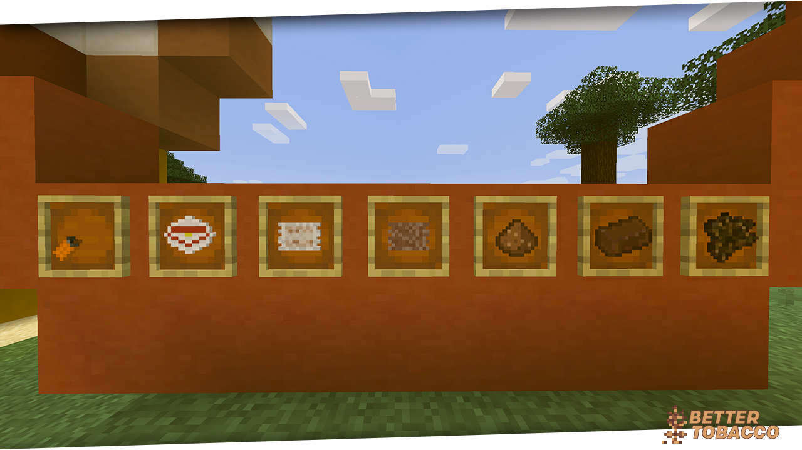
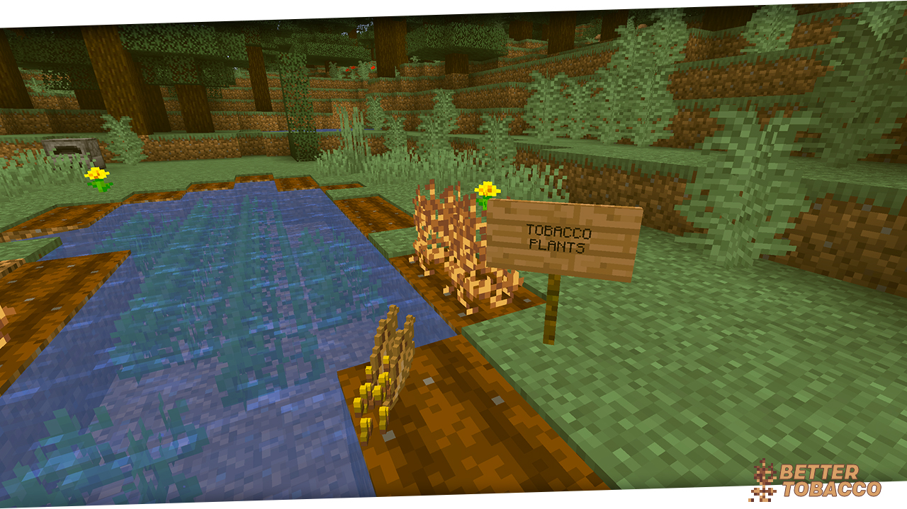
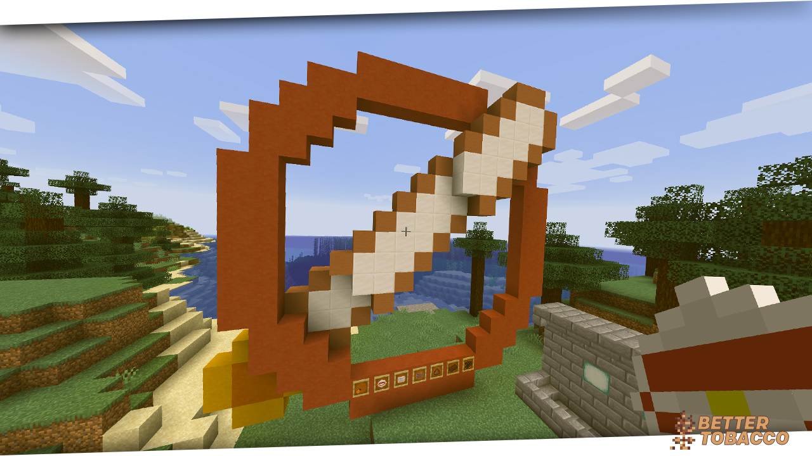
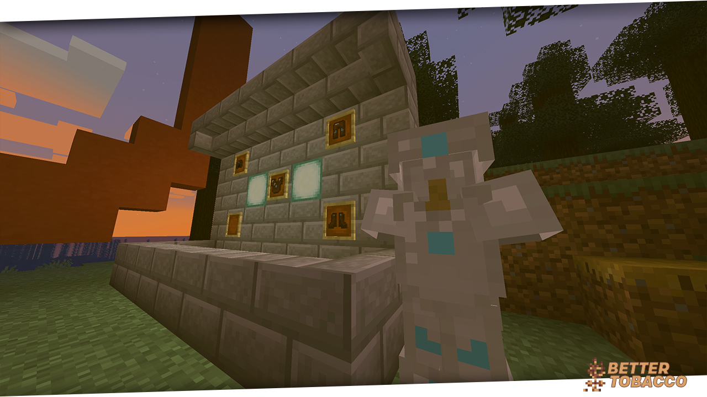
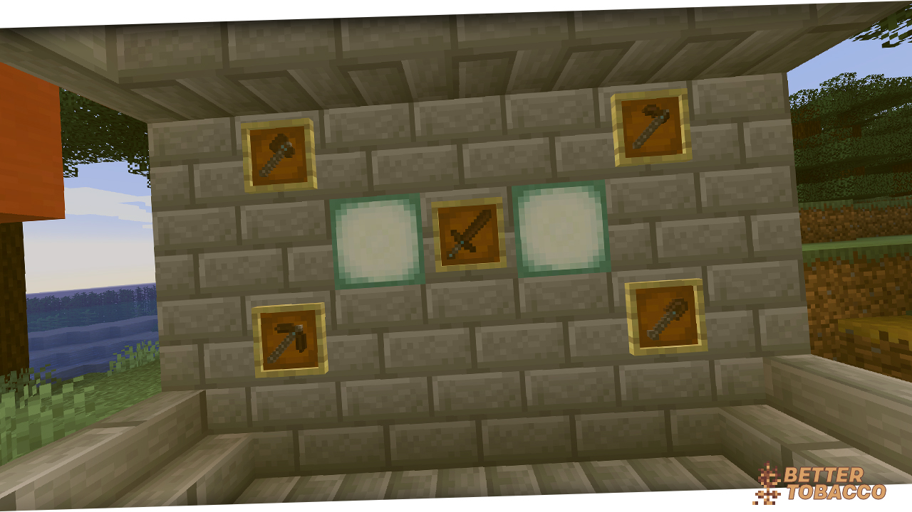

     
    
    <h1>BetterTobacco</h1>
    <h3>Better Tobacco Mod for Minecraft 1.14.4</h3>

## Information

🔞
Please keep in mind that this mods goal isn't to glorify the consumption of tobacco products. The consumption of tobacco products is from the age of 18 onwards in most EU countries.
Smoking damages your health, therefore we don't recommend consumption in real life.
🔞
---

Better Tobacco is a Minecraft 1.14.4 Mod, which aims to add diverse tobacco products to Minecraft. This mod includes many common Tobacco Products, like cigarettes, snus and hookah tobacco as well as Side Features like Plants, Armor, Tools, Biomes and Mobs.

### Getting Started
Everything in BetterTobacco depends on one item: Raw Tobacco. Raw Tobacco can be obtained by harvesting Tobacco Plants, which generate in the Mods Tobacco Biome. Tobacco Seed, which is required to grow your own Tobacco Plants, is also acquired through Tobacco Plants. Dried Tobacco, the core element of all Tobacco Products, can be manufactured by smelting Raw Tobacco.

### Whats next?
Once you obtain Dried Tobacco, you can start crafting a diverse Sortiment of Tobacco Products. These can be consumed, granting the user various effects, depending on the product used. Thanks to these effects, using Tobacco Products during Boss fights and regular action is viable.

### Where can I find Crafting Recipes?
Please see this GitHub Repos [Wiki](https://github.com/VenelALEX/BetterTobaccoMod/wiki) for various Recipes and other Information.

## Screenshots

Items            |  Crops
:-------------------------:|:-------------------------:
  |  
Items                | Armor
 | 
Tools

## Supported Languages

          

@Flag icons - http://www.icondrawer.com/

### Like our work?

*Every donation is welcome!*

