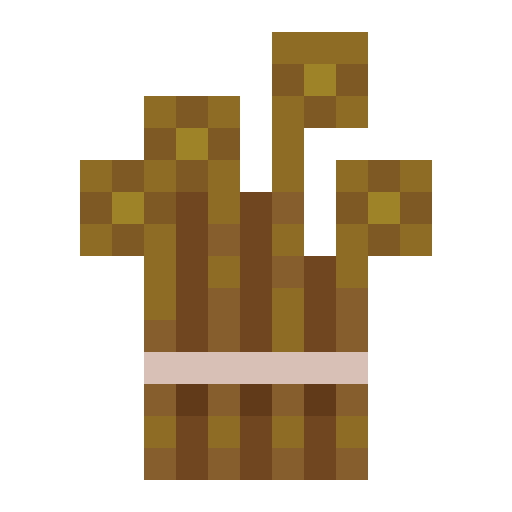

     
    
    <h1>BetterTobacco</h1>
    <h3>Better Tobacco Mod for Minecraft 1.14.4</h3>

## TODO

###Add Items (Model, Textures, Lang, Functionality)
- [ ] Add Tobacco Seeds
- [ ] Add Dried Tobacco
- [ ] Add Cigarettes
- [ ] Add *Suprise* Item
- [ ] Add Hookah Tobacco

###Add Blocks (Model, Textures, Lang, Functionality)
- [ ] Add Hookah usw...

###Add Concepts for:
- [ ] Hookah
- [ ] Biomes
- [ ] Custom Mobs
